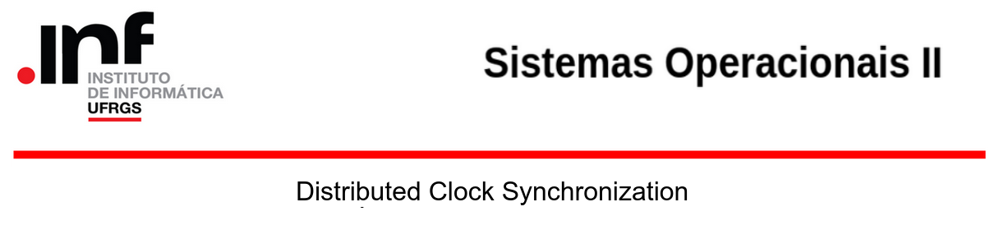
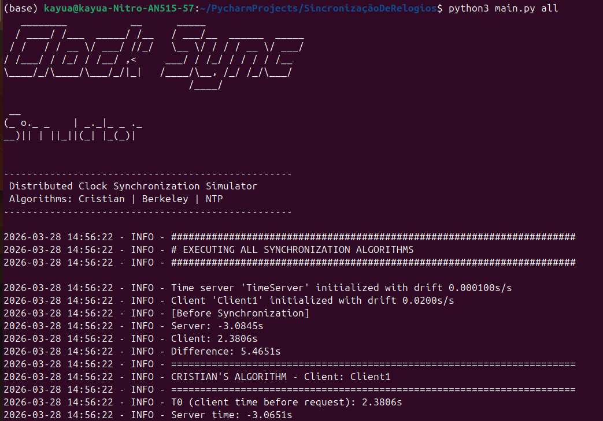

# Distributed Clock Synchronization Simulator
This code implements a simulation environment for three major clock synchronization algorithms used in distributed systems: Cristian's Algorithm, Berkeley Algorithm, and Network Time Protocol (NTP). In this system, nodes exchange timestamps over a simulated network, where configurable latency models real-world communication delays. Each algorithm addresses the challenge of maintaining a consistent notion of time across distributed processes, either by synchronizing to an authoritative time server or by reaching internal agreement among peers. Clock drift is modeled per node, allowing the simulation to reproduce the imperfections of real hardware clocks and measure the accuracy achieved by each synchronization strategy.

## 1. Steps to Install:
### 1. Upgrade and update
   ```bash   
   sudo apt-get update
   sudo apt-get upgrade 
   ```
### 2. Installation of application and internal dependencies
    git clone https://github.com/your-username/clock-sync-simulator.git
    pip install -r requirements.txt
   
## 2. Run experiments:
### 1. Run (clock_sync_simulator.py) with chosen algorithm

    python3 clock_sync_simulator.py (algorithm) (arguments)
    Example: python3 clock_sync_simulator.py cristian --client-drift 0.05 --log-level DEBUG

### Input parameters:
    Algorithm (required, choose one):
        cristian        Simulate Cristian's Clock Synchronization Algorithm
        berkeley        Simulate Berkeley Clock Synchronization Algorithm
        ntp             Simulate Network Time Protocol (NTP)
        all             Run all synchronization algorithms sequentially

    Arguments:
        --log-level         Logging verbosity: DEBUG, INFO, WARNING, ERROR (default: INFO)
        --log-file          Write logs to specified file path
        --min-delay         Minimum simulated network delay in seconds (default: 0.01)
        --max-delay         Maximum simulated network delay in seconds (default: 0.10)
        --server-drift      Server clock drift rate in s/s (default: 0.0001)
        --client-drift      Client clock drift rate in s/s (default: 0.02)
        --num-slaves        Number of slave nodes, Berkeley/all only (default: 3)
        --master-drift      Master clock drift rate, Berkeley/all only (default: 0.015)
    --------------------------------------------------------------

## 3. Implemented algorithms


### Cristian's Algorithm
Records client time before (T0) and after (T1) a server request, estimates the true server time as `server_time + RTT/2`, and performs a hard clock adjustment. Assumes symmetric network delays.

### Berkeley Algorithm
A master node polls all slaves, computes the average time across every node (including itself), and distributes incremental adjustments so all clocks converge to the same value. Targets internal consistency, not absolute accuracy.

### Network Time Protocol (NTP)
Uses four timestamps (T1–T4) to independently compute network delay `δ = ((T4−T1) − (T3−T2)) / 2` and clock offset `θ = ((T2−T1) + (T3−T4)) / 2`, then applies a soft adjustment. Server processing time is assumed negligible in this simulation.

## 4. Requirements:
`python 3.8+`
`argparse`
`logging`
